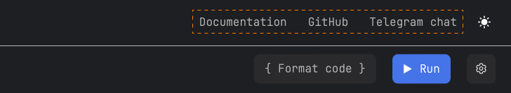
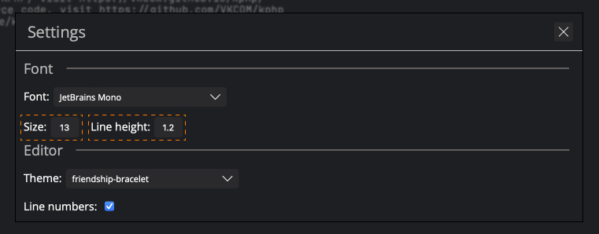
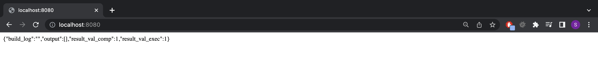

# KPHP Playground: Run, Edit KPHP Code Online

[](/LICENSE)

The [KPHP Playground](https://kphp-playground.ru/) is a place where you can run and edit KPHP code online.


# Table of contents
- [Features](#features)
- [UI](#ui)
- - [Additional sources](#additional-sources)
- - [Change theme](#change-theme)
- - [Run code](#run-code)
- - - [Build Log](#build-log)
- - - [Output](#output)
- - [Examples](#examples)
- - [Refresh example](#refresh-example)
- - [Run arguments](#run-arguments)
- - [Format code](#format-code)
- - [Settings](#settings)
- - - [Font settings](#font-settings)
- - - [Editor settings](#editor-settings)
- [Developing](#developing)
- - [Install PHP (for fast testing code)](#install-php-for-fast-testing-code)
- - - [For Linux](#for-linux)
- - - [For macOS](#for-macos)
- - - [Check installation](#check-installation)
- - [Install KPHP (for compile project)](#install-kphp-for-compile-project)
- - [Install and run project for developing on PHP](#install-and-run-project-for-developing-on-php)
- - [Compile and run project for deploy on KPHP](#compile-and-run-project-for-deploy-on-kphp)
- [License](#license)

# Features
- Attractive and simple UI
- Ability to run programs with arguments
- Ready-made examples
- Formatting the code
- Dark and light theme
- The ability to edit fonts and editor for yourself

[🔝Table of contents](#table-of-contents)

# UI
## Additional sources

If you want to learn more about KPHP, then there are several useful links in the playground for this:
- [Documentation](https://vkcom.github.io/kphp/) - KPHP documentation.
- [GitHub](https://github.com/VKCOM/kphp) - KPHP source code.
- [Telegram chat](https://t.me/kphp_chat) - The chat where you can ask, answer or discuss various questions related to KPHP.



## Change theme
The `KPHP Playground` supports changing the theme. You can choose a dark or light theme depending on your tastes.


## Run code
In order to compile and run your program, click on the `Run` button.


After launching the program, a console will appear from below.

### Build Log

If you want to see the compiler output, then go to the `build log` in the console.


### Output

If you want to see the output of the program, go to the `output` in the console.


## Examples
There are several examples with comments in the `KPHP Playground` that you can view and run. \
To study the example, click on the `Examples` button and select an example from the drop-down list.


## Refresh example
If you suddenly messed up the example and want to restore it, then you should click the `Refresh` button.


## Run arguments
Also, `KPHP Playground` supports the ability to pass arguments to the program. \
To pass arguments to the program, they should be written in `Run arguments` input.


## Format code
The style of the code is very important, so `KPHP Playground` provides an opportunity to format the code. \
To do this, click on the `{ Format code }` button.


## Settings
`KPHP Playground` provides the ability to configure some parameters so that it's comfortable for you to write code. \
In order to go to the settings, you need to click on the gear.


### Font settings
- You can choose the font of the code.


- You can specify the font size and line spacing.



### Editor settings
- It's also possible to choose a theme for the code editor.


- You can specify whether you need the line numbers to be displayed in the editor or not.


[🔝Table of contents](#table-of-contents)

# Developing
If you want to contribute to this project and engage in development , then for this you will need:

## Install PHP (for fast testing code)
### For Linux
1. Update your packages:
```
$ sudo apt-get update
```
2. Upgrade your packages:
```
$ sudo apt-get upgrade
```
3. Install PHP:
```
$ sudo apt-get install php
```
4. Check:
```
$ php --version
```

### For macOS
1. Install PHP:
```
$ brew install php
```

### Check installation
```
$ php --version
```

If the installation was successful, you should see something like this output:
```
PHP 8.0.28 (cli) (built: Feb 14 2023 15:42:52) ( NTS )
Copyright (c) The PHP Group
Zend Engine v4.0.28, Copyright (c) Zend Technologies
    with Xdebug v3.2.1, Copyright (c) 2002-2023, by Derick Rethans
```

## Install KPHP (for compile project)
How to install KPHP, see the official documentation:
- [For Linux](https://vkcom.github.io/kphp/kphp-basics/installation.html#install-kphp-from-deb-packages)
- [For macOS](https://vkcom.github.io/kphp/kphp-basics/installation.html#install-kphp-for-macos)

## Install and run project for developing on PHP
1. Open the terminal and clone the repository:
```
$ git clone https://github.com/Tsygankov-Slava/kphp-playground.git
```
2. Go to the project directory:
```
$ cd kphp-playground
```
3. Start the local php server on port 8000 (You can choose a different port):
```
$ php -S localhost:8000
```
4. Open [http://localhost:8000/www/index.html](http://localhost:8000/www/index.html) in browser. \
If everything went well, you should observe the main page of the project:


P.S. The code written in KPHP is interpreted by PHP without any problems. \
So use a `php server` for development and testing. When you have tested the code, it needs to be compiled and run on the `kphp server`.

## Compile and run project for deploy on KPHP
1. Compile `index.php`:
```
$ cd /kphp-playground/server/
$ kphp index.php
```
2. Run server:
```
$ cd kphp_out/
$ ./server -H 8080 -f 1
```
3. After starting the `kphp server`, you should go to http://localhost:8080/ and see the server page:



[🔝Table of contents](#table-of-contents)

# License
`kphp-playground` is distributed under the [MIT License](https://github.com/Tsygankov-Slava/kphp-playground/blob/main/LICENSE), on behalf of Tsygankov Viacheslav.

[🔝Table of contents](#table-of-contents)